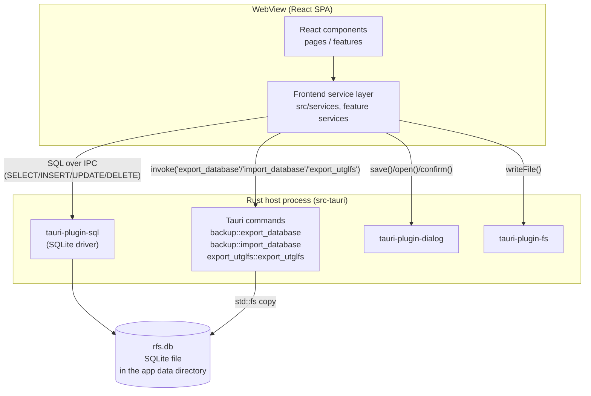
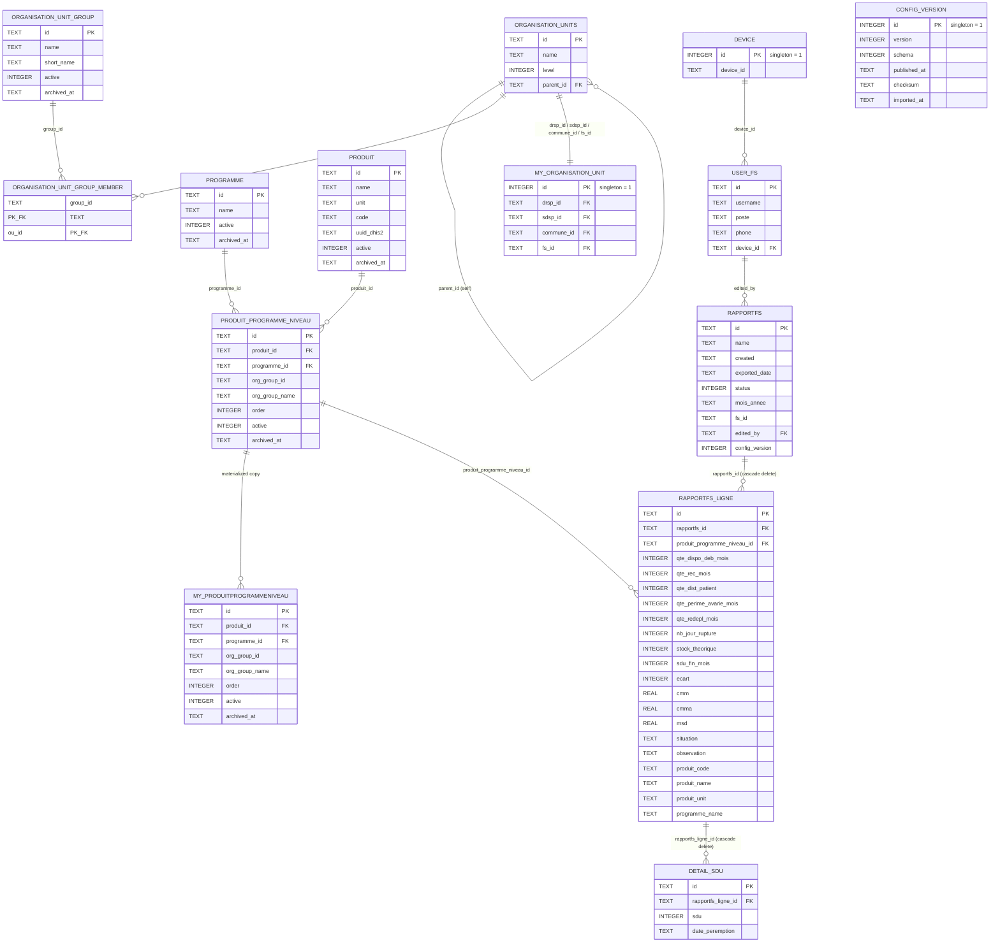

# GAS Hôpitaux — Technical Documentation

Application: **GAS Hôpitaux** (`productName` in `tauri.conf.json`; Cargo package name `GAS_HOPITAUX`; Tauri identifier `com.rdavi.hopitaux`)
Version at time of writing: **1.0.5**

This document describes the software architecture, low-level design, features, API surface, database schema/data model and release-build process of the GAS Hôpitaux application, strictly as implemented in this repository.

---

## 1. What this application is

GAS Hôpitaux is an **offline-first Windows desktop application** used by hospital pharmacy staff in Madagascar to fill in, validate and export the **monthly stock-utilization report** ("Rapport FS") for one hospital ("Formation Sanitaire", FS), per health programme and per product. It is one member of a family of "UTGL" (Unité Technique de Gestion Logistique) desktop tools — this build's own code references a companion build, `utgl-csb`, for health centers — that all exchange configuration and report files with a central UTGL server, which is **outside this repository**.

The app:
- runs fully offline, storing all its data in a local SQLite database file;
- imports its reference data (organisation units, health programmes, products, product/programme/level assignments) from a `utgl_config.json` file produced by the central server;
- lets a user create one report per month, enter stock figures per product, and view computed indicators and stock-status alerts;
- exports a completed report as a `.utglhp` file (a Parquet file) for later import into the central UTGL platform;
- can back up and restore its entire local database as a `.rfsbak` file;
- is built to run on **Windows 7 SP1 and later**, which is the binding constraint on several technical choices described in §7.

---

## 2. Technology stack

| Layer | Technology |
|---|---|
| Desktop shell / native runtime | [Tauri 2](https://tauri.app) (Rust host process + OS WebView) |
| Rust dependencies | `tauri`, `tauri-plugin-sql` (SQLite), `tauri-plugin-dialog`, `tauri-plugin-fs`, `tauri-plugin-opener`, `arrow` + `parquet` (Parquet file writer), `base64`, `serde`/`serde_json` |
| Frontend framework | React 19 + TypeScript, built with Vite 7 |
| Routing | `react-router-dom` 7, `createHashRouter` (hash-based routing, required for a `file://`/webview-hosted SPA) |
| UI component library | MUI (Material UI) 9 — `@mui/material`, `@mui/x-data-grid`, `@mui/x-date-pickers`, `@emotion` |
| Local database | SQLite, accessed from the frontend through `@tauri-apps/plugin-sql` (`sqlite:rfs.db`) |
| Date handling | `dayjs` (date pickers), hand-written UTC-safe parsing for stored `YYYY-MM`/`YYYY-MM-DD` strings |
| Styling | MUI `sx` props/theme + a small amount of SCSS (`App.scss`) |
| Packaging | Tauri bundler, NSIS installer target (Windows) |

There is **no web backend and no CI/CD pipeline** in this repository: the application is a standalone Windows desktop product, and its only server-side counterpart (the UTGL central server that produces `utgl_config.json` and consumes `.utglhp` exports) lives in a separate codebase.

---

## 3. Software architecture

### 3.1 Process model

A Tauri 2 application is two cooperating parts inside one OS process tree:

1. **The Rust host** (`src-tauri/`) — creates the native window, embeds a WebView2 control (on Windows), registers plugins, and exposes a small set of **IPC commands** the frontend can call.
2. **The frontend** (`src/`) — a React single-page application rendered inside that WebView, communicating with the Rust host only through Tauri's IPC (`@tauri-apps/api/core`'s `invoke`) and through official Tauri plugins (`plugin-sql`, `plugin-dialog`, `plugin-fs`).



**Key architectural characteristic:** most data access does **not** go through a custom Rust command layer. `@tauri-apps/plugin-sql` lets the frontend send parameterized SQL statements straight to the local SQLite database over Tauri's IPC channel; the Rust side of this app therefore contains almost no business logic. Rust is reserved for three things the plugin/browser sandbox cannot do on its own:
- copying/overwriting the raw database file for backup and restore (`backup.rs`), because the frontend has no privileged filesystem access outside `plugin-fs`'s scope and no way to safely swap out a file the SQL connection pool has open;
- building a real Parquet file in memory for report export (`export_utglfs.rs`), because there is no Parquet writer available to the webview's JavaScript runtime;
- a Windows‑7‑only linker shim with no business relevance (`win7_etw_shim.rs`, see §7).

### 3.2 Frontend layering

The frontend follows a **feature-folder** structure layered on top of `react-router-dom`:

```
src/
├── main.tsx                 # React root: AppThemeProvider + RouterProvider
├── router.tsx                # createHashRouter route table
├── App.tsx                   # Shell: NotificationProvider, AppBar, <Outlet/>, Footer
├── pages/                     # One component per route, composing feature components
│   ├── home-redirect/         # "/" — startup routing decision
│   ├── rapportfs-list/        # "/rapports"
│   ├── rapport-edit/          # "/rapport-edit/:id" (minimal placeholder route)
│   ├── rapport-view/          # "/rapport-view/:id"
│   ├── alertes/                # "/alertes"
│   ├── parametres/             # "/parametres"
│   └── help/                   # "/help"
├── features/                  # Feature-scoped UI + services + models, one folder per domain
│   ├── rapports/                # Reports: list, per-produit table, edit dialog, services, model
│   ├── alertes/                 # Stock alerts derived from the latest report
│   ├── configuration/           # Config-file import, config versioning, backup/restore
│   ├── organisation-units/      # Organisation-unit cascade selector + reference-data services
│   ├── userprofile/             # Device/user profile (username, poste, phone)
│   ├── appbar/, footer/         # Chrome
├── services/                  # App-wide, feature-agnostic services
│   ├── db.ts                    # Database.load() singleton (opens sqlite:rfs.db)
│   ├── device-service.ts        # Singleton device id (table `device`)
│   ├── id-service.ts            # crypto.randomUUID() wrapper
│   └── startup-route-service.ts # Decides "/parametres" vs "/alertes" vs "/rapports"
├── notifications/             # App-wide success/error Snackbar (React context)
├── theme/                     # MUI theme, Win7-specific DataGrid CSS overrides, color picker
└── utils/                     # date-format.ts, mois-annee.ts, phone-format.ts
```

Each feature under `src/features/<name>/` follows the same internal shape: `components/` (React UI), `services/` (functions that call `getDb()` and run SQL), and `models/` (TypeScript interfaces). Pages under `src/pages/` are thin wrappers that mount one feature component per route; almost all logic lives in the feature layer.

### 3.3 Data-flow pattern

Every feature service module follows the same pattern:

```ts
export async function someOperation(...) {
  const db = await getDb();                 // singleton Database handle (plugin-sql)
  const rows = await db.select<Row[]>(sql, params);   // or db.execute(sql, params)
  return mapRowToDomainModel(rows[0]);
}
```

`getDb()` (`src/services/db.ts`) memoizes a single `Database.load("sqlite:rfs.db")` promise for the app's lifetime (or `sqlite:rfs-dev.db` when `VITE_MOCK_DB=1`, used only by the `dev:mock` script — see §5.8). All SQL is parameterized (`$1`, `$2`, …); there is no query builder or ORM.

### 3.4 State management

There is no global state library (no Redux/Zustand/etc.). State is local `useState`/`useEffect` in each page/feature component, re-fetched from SQLite on mount or after a mutation. The only cross-cutting React contexts are:
- `NotificationProvider` (`src/notifications/notification-provider.tsx`) — a single app-wide success/error `Snackbar`;
- `AppThemeProvider` (`src/theme/theme-colors-context.tsx`) — the MUI theme (with a user-adjustable primary/secondary/accent color palette, not persisted across restarts).

### 3.5 Routing

`react-router-dom`'s `createHashRouter` is used (`src/router.tsx`), i.e. routes are addressed as `#/rapports`, `#/rapport-view/:id`, etc. This is the standard choice for a Tauri/webview SPA that is not served by an HTTP server with history-API fallback. Route `"/"` renders `HomeRedirectPage`, which never shows content itself — it calls `determineStartupRoute()` and redirects.

---

## 4. Low-level design

### 4.1 Startup routing logic

`src/services/startup-route-service.ts` — `determineStartupRoute()` runs three checks in parallel on every app launch (and every navigation back to `"/"`):

1. Is there a saved organisation unit (`getMyOrganisationUnit()`)?
2. Is there a saved user profile (`getUserProfile()`)?
3. Does the device have at least one applicable product (`hasAnyMyProduitProgrammeNiveau()`)?

If any of the three is missing, the app lands on **`/parametres`** (setup wizard). Otherwise it lands on **`/alertes`** if at least one report exists (`hasAnyRapportFs()`), or **`/rapports`** (empty list, inviting report creation) if not.

### 4.2 Setup wizard (`/parametres`)

`ParametresPage` renders a non-linear MUI `Stepper` with five independent panels, each a self-contained feature component (all keep their own load/save state — nothing is coordinated by the stepper itself):

1. **Profil utilisateur** (`UserProfile`) — username, `poste` (role/function), phone (validated as a 10-digit local number starting with `0`), stored in `user_fs`.
2. **Configuration** (`ConfigImportTab`) — file picker for `utgl_config.json`; parses, validates and imports it (see §4.4).
3. **Unité d'organisation** (`OrganisationUnitCascade`) — cascading `Autocomplete` selectors: DRSP (region, level 2) → SDSP (district, level 3) → Hôpital (facility, level 5, filtered to the `HOPITAUX` organisation-unit group, grouped by commune). Saves the singleton `my_organisation_unit` row and triggers a rebuild of `my_produitprogrammeniveau`.
4. **Produits** (`ProduitsProgrammeTable`) — read-only, per-programme tabbed table of the products this facility is currently configured to report on (renders nothing until step 2 and 3 are both done).
5. **Sauvegarde** (`BackupTab`) — manual database backup/restore.

### 4.3 Reports (`/rapports`, `/rapport-view/:id`)

- **List page** (`RapportTableList` → `TableList`, an MUI `DataGrid`): one row per `rapportfs`, columns Mois/Année, Nom, Date de création, Statut (Complet/Incomplet chip), Date d'export. Single-row selection drives three actions: **Détails** (navigate to the view page), **Exporter** (disabled unless the report's `status` is complete), **Supprimer** (confirmation dialog, hard delete — cascades to `rapportfs_ligne`/`detail_sdu` via `ON DELETE CASCADE`).
- On every list load, `computeRollingCmm()` (§4.6) runs first and the list is re-fetched if it touched anything, so CMM/CMMA figures appear as soon as a 4th consecutive month exists.
- **Creation** (`RapportfsAddSheet`): a month picker restricted to (a) not already covered by an existing report for this facility, (b) not later than the current month. Creating a report immediately runs `refreshRapportFsStatus` (vacuously "Complet" if the facility has no applicable products yet) and `computeRollingCmm`, then navigates to the view page.
- **View/edit page** (`RapportViewPage` → `RapportProgrammeTable`): one tab per health programme; each tab is a table of the programme's products (`getProgrammeSections`) with an expandable read-only detail row and an **Editer** action opening `EditLigneDialog`.

### 4.4 Per-line edit form and computed fields (`EditLigneDialog`, `rapport-programme-table.tsx`)

This is the core business-logic component of the application. For one product line, the form captures 6 user-entered fields and derives the rest live, client-side, using the *same* formulas the database ends up storing (so a saved line always matches what was shown):

| Field | Kind | Formula / rule |
|---|---|---|
| `qte_dispo_deb_mois` (opening stock) | entered | defaults to the **previous consecutive month's `sdu_fin_mois`** for the same product/facility, if the line hasn't been filled in yet this month |
| `qte_rec_mois` (received) | entered | — |
| `qte_dist_patient` (distributed to patients) | entered | max = opening stock + received |
| `qte_perime_avarie_mois` (expired/damaged) | entered | — |
| `qte_redepl_mois` (redeployed) | entered | — |
| `nb_jour_rupture` (stock-out days) | entered | 0 ≤ value ≤ number of days in the report's month; if there was **no movement at all** this month (all five quantities above are 0/blank), the minimum becomes 1 (the product cannot have been continuously available with zero activity) |
| `stock_theorique` (theoretical stock) | computed | `qte_dispo_deb_mois + qte_rec_mois − qte_redepl_mois − qte_dist_patient − qte_perime_avarie_mois` |
| `sdu_fin_mois` (SDU — usable stock on hand at month end) | computed | sum of the line's **Détails SDU** entries (see below); **stays `null`** (not 0) until at least one Détail SDU is entered |
| `ecart` (variance) | computed | `sdu_fin_mois − stock_theorique`; `null` while `sdu_fin_mois` is `null` |
| `cmm` (CMM — average monthly consumption) | entered, min 1 once filled | manually entered here; also auto-filled by the rolling-CMM job (§4.6) |
| `cmma` (CMMA — adjusted CMM) | computed elsewhere | echoed read-only here; only ever populated by the rolling-CMM job |
| `msd` (MSD — months of stock on hand) | computed | `round(sdu_fin_mois / cmm, 2)` if both are set and `cmm ≠ 0`, else `0` |
| `situation` | computed | derived from `msd` (see table below); empty string while `sdu_fin_mois` is `null` |
| `observation` | entered | free text |

**Situation thresholds** (`computeSituation`, mirrored server-side by the UTGL platform):

| MSD | Situation |
|---|---|
| `> 4` | SURSTOCK (overstock) |
| `2 ≤ MSD ≤ 4` | NORMAL |
| `0 < MSD < 2` | SOUS STOCK (low stock) |
| `MSD = 0` (or no SDU entered) | RUPTURE (stock-out) |

**Détails SDU**: a line's SDU is not a single number but a list of `{sdu, date_péremption}` batches (`detail_sdu` table), matching how pharmacy stock is actually counted (by expiry batch). A batch with `sdu = 0` has no expiry date. `sdu_fin_mois` is always the *sum* of these batches, never entered directly — the UI shows an explicit warning banner until at least one is entered.

A field's client-side validity rule only triggers once something has been typed (a blank stays "not yet entered", which is allowed and simply keeps the line's completeness badge at "Incomplet").

Saving a line (`saveRapportFsLigne`) is an upsert keyed on `(rapportfs_id, produit_programme_niveau_id)`; it also copies the product's **current** code/name/unit/programme-name onto the row (`produit_code`, `produit_name`, `produit_unit`, `programme_name`) *on insert only*, so that a later product rename or archival never rewrites what a report already displays.

### 4.5 Carry-forward propagation (`propagateQteDispoDebMois`)

Because a month's opening stock is the previous month's closing stock, saving a line's `sdu_fin_mois` walks forward through every later **consecutive** month (same facility, same product) that already has a value for `qte_dispo_deb_mois`, and rewrites `qte_dispo_deb_mois` (and the `stock_theorique`/`ecart` derived from it) using the same formulas as the edit form — stopping at the first month that has no line yet, or whose opening stock was never entered (that month will simply pick up the fresh value the next time it's opened). Only rows that were already non-`null` are rewritten, so this can never change a report's completeness status.

### 4.6 Rolling CMM computation (`rapport-cmm-service.ts`)

CMM/CMMA require **4 consecutive months of history** for the same facility. `computeRollingCmm(reports)`, run on every reports-list load and right after report creation:

1. Groups all reports by facility, then by parsed `mois_annee`.
2. For every report that is the 4th in a run of 4 consecutive months, looks at each product reported in **all 3 preceding months** (a month only "counts" if it has a real `qte_dist_patient`/`nb_jour_rupture`, not just an auto-created placeholder row):
   - `cmm = round((month1 + month2 + month3 distributed quantities) / 3)`
   - `cmma = (total distributed × 30) / (90 − total stock-out days)` if there was any stock-out across the 3 months, else `null`
3. Upserts `cmm`/`cmma` onto the 4th month's line for that product (creating the line if it doesn't exist yet, so the figure is visible without the user having to touch that product first). A line is only *created* on a row still collected (`active = 1`): one created on a withdrawn row would put it back on the report, "Retiré", next to the row that replaced it.
4. Returns the ids of every report it modified, so callers re-run `refreshRapportFsStatus` on them.

### 4.7 Report completeness (`rapport-completeness.ts`, `refreshRapportFsStatus`)

A `rapportfs_ligne` is **"Complet"** only if all of `MANDATORY_LIGNE_FIELDS` are non-null: `qte_dispo_deb_mois`, `qte_rec_mois`, `qte_dist_patient`, `qte_perime_avarie_mois`, `qte_redepl_mois`, `nb_jour_rupture`, `sdu_fin_mois`, `cmm`. (`stock_theorique`, `ecart`, `msd` are excluded as purely derived; `cmma` and `observation` are not required.) A `rapportfs` is **"Complet"** only if *every* product the report shows — those the **report's own facility** (`rapportfs.fs_id`) owes through its categories (`ppnOwedBy`), still active, plus withdrawn ones the report already has a line for (the same rule as `getProgrammeSections`) — has a complete line for it. The device's current facility (`my_produitprogrammeniveau`) never decides what a report contains: a device moved to another hospital keeps the first one's reports, and a report for a hospital that is not an LRR must not list, count or export LRR products — recomputed by `refreshRapportFsStatus()` after every line save and every report creation, and stored denormalized on `rapportfs.status` (used directly by the list page's grid and by the Export button's `disabled` state).

### 4.7.1 Products the hospital reports (Paramètres → Produits)

The product list under Paramètres has a checkbox per product × programme (and one per programme tab to tick or untick all of it), saved with **Enregistrer**. Every row the facility owes is reported by default; the unticked ones are stored per facility in `ppn_exclusion` (migration 12), so rows a new configuration adds appear without anyone ticking them, and a device moved to another hospital does not carry these choices across. An unticked product is left off the hospital's reports — the report screen, completeness, the CMM pass and the export all apply `reportListsPpn` (`applicability.ts`) — except where a report already holds figures for it: those are never dropped, and ticking the product again brings it back everywhere. Saving re-judges the completeness of the hospital's reports.

### 4.8 Alerts (`/alertes`)

`getLatestRapportFs()` picks, for the device's saved facility, the report whose `mois_annee` ranks highest (numeric `year*12+month` comparison, tolerant of the two date formats the column has historically stored). `getAlertesSections()` reuses the exact same `getProgrammeSections()` query as the report view page and buckets each programme's rows by `situation === "RUPTURE"` / `"SOUS STOCK"`. The page is a read-only, per-programme tabbed summary — it does not let the user edit anything.

### 4.9 Configuration import & versioning

- **File contract** (`config-model.ts`): `utgl_config.json` must declare a numeric `schema` (currently `SUPPORTED_SCHEMA = 6`, and at least `MIN_SCHEMA = 5`) and `version` (a forward-only integer, the server's `ConfigurationVersion.id`), plus arrays `organisation_units`, `organisation_unit_groups`, `programmes`, `produits`, `produit_programme_niveau`, `deactivated` (tombstones). A file with a *newer* schema than the app supports is rejected outright (never partially imported); a file with a version older than what's already installed is rejected too (configuration is forward-only, since the app already reasons about "not yet withdrawn" vs. "withdrawn").
- **Import** (`config-import-service.ts`, `importConfig`): reference tables that have live foreign keys pointing into them (`organisation_units`, `produit`, `programme`, `produit_programme_niveau`) are **upserted**, never wholesale-replaced, because deleting a still-referenced row would violate SQLite's foreign-key constraints (and, more importantly, would break already-captured reports). Tables with no dependents (`organisation_unit_group`, `organisation_unit_group_member`) are replaced wholesale. After the upsert, `refreshMyProduitProgrammeNiveau()` rebuilds the facility's materialized product list, and the file's `deactivated` tombstones are applied (marking rows `active = 0` with an `archived_at` timestamp — **never deleting** them, so a report that already captured an archived product keeps displaying it, tagged "Retiré").
- **Absent means withdrawn**: before the upserts, every `produit`, `programme` and `produit_programme_niveau` row is marked archived, and the upserts re-activate exactly what the file lists. The server publishes only what is still collected but tombstones only what it archived itself, so the rows of an archived product or programme, and products it merged away, would otherwise stay on offer.
- **Merged products** (`reattachWithdrawnLines`, run after the tombstones): the server configures one row per product × programme and has merged the same-named product copies the old per-group configuration left (utgl-web configuration migrations 0010 and 0015, keeping the CSB copy — so the HOPITAUX copies hospitals held were the ones merged away). The file does not carry the server's aliases, so the device re-derives them: a line on a withdrawn row moves to the active row of the same programme for the same product — by id, or, when the old copy's product is gone, by name (whitespace collapsed, case ignored; unique among active products on the server). Only an unambiguous match is used; a line that would land on a report already holding a filled-in line for the replacement stays where it is, as on the server. Every report's status is then re-judged. Without this, every report that had captured a merged product listed it twice, and its CMM history and carried-over opening stock were lost.
- **Configuration version** (`config-version-service.ts`, table `config_version`, a singleton row): records which configuration version the device currently holds. Every report is stamped with this version when created and **re-stamped right before export** (`stampReportWithConfigVersion`), so the central server can judge a report's completeness against the configuration it was actually filled in against, not the one installed today.

### 4.10 Report export (`rapportfs-export-service.ts` + `export_utglfs.rs`)

`exportRapportFsToUtglfs(rapportfsId)`:
1. Builds the proposed file name `"Rapport - <MM-YYYY> - <district> - <hôpital>"` from the **report's own** facility and district (illegal Windows path characters stripped) and opens a native save dialog (`.utglhp` filter).
2. Re-stamps the report's `config_version` (see §4.9), then stamps `exported_date` — in that order, deliberately, so the exported file itself carries the fresh timestamp.
3. Reads the raw rows of five tables (`my_produitprogrammeniveau`, `my_organisation_unit`, `user_fs`, `rapportfs` — filtered to this report — and `rapportfs_ligne` with its nested `detail_sdu`) with **no joins or derived fields**: the export is a faithful snapshot of exactly what's stored, for the server to reconstruct.
   Everything describes the report's own facility (`rapportfs.fs_id`), not the device's current one: `my_organisation_unit` is that facility's DRSP › SDSP › commune chain read up the organisation tree (utgl-web files the report under that district and refuses a file naming two facilities), `my_produitprogrammeniveau` lists the products it owes, and only lines on those products are sent.
4. Calls the Rust command `export_utglfs` with that payload; it serializes each table's rows as a JSON array string and writes a **single-row, 5-column Parquet file** (one column per table, `Utf8` type) using `arrow`/`parquet`, returned base64-encoded. (One row is used because Parquet requires one fixed schema for a whole file, and the five source tables have unrelated shapes and sizes.)
5. The frontend decodes the base64 and writes the file with `@tauri-apps/plugin-fs`'s `writeFile` — deliberately *not* written directly by Rust, because on mobile targets the save dialog can return a `content://` SAF URI that plain `std::fs` cannot write to (this app currently ships Windows-only, but the export code is shared with the mobile-capable sibling builds).
6. If anything after step 2 throws, the `exported_date` stamp is rolled back to its previous value, so a failed export never leaves the report falsely marked as sent.

### 4.11 Backup & restore (`backup-service.ts` + `backup.rs`)

- **Backup**: runs `PRAGMA wal_checkpoint(TRUNCATE)` on the live connection (flushes the WAL into the main file) then calls Rust command `export_database`, which `std::fs::copy`s `rfs.db` from the app data directory to the user-chosen `.rfsbak` path.
- **Restore**: confirms with the user, lets them pick a `.rfsbak` file, **closes the SQL plugin's connection pool** (`db.close()`) so the file isn't locked, then calls Rust command `import_database`, which deletes any stray `rfs.db-wal`/`rfs.db-shm` journal files and copies the chosen file over `rfs.db`. The UI then tells the user to restart the app (there is no in-process re-open of a freshly-restored database).

### 4.12 Device & user identity

- `device` table: a single row (`id = 1`), generated once via `crypto.randomUUID()` on first launch (`getDeviceId()`, called from `App.tsx`'s mount effect) and never changed again for the life of the install.
- `user_fs` table: in practice a single row (one profile per device), carrying `username`, `poste` (function/role), `phone` (raw 10-digit local number, formatted for display only), and the device id it was saved on.

### 4.13 Windows 7 / WebView2 CSS compatibility

`src/theme/theme-colors-context.tsx` overrides two MUI X DataGrid CSS custom properties (`--DataGrid-t-color-interactive-focus`, `--DataGrid-t-color-interactive-disabled`) with plain `rgba()` values, because WebView2 109 (Windows 7's runtime ceiling) has no support for CSS relative-color syntax (`rgb(from …)`, a Chrome 119+ feature) and the DataGrid's own focus/disabled styling uses it with no fallback — without the override, the grid's focus outline silently disappears on Windows 7. The selector is doubled (`&&`) because MUI DataGrid injects its own CSS-variable `<style>` tag into `<body>`, which otherwise outranks a plain theme override injected into `<head>`.

---

## 5. Features

- **Setup wizard** — user profile, configuration import, organisation-unit selection, applicable-product review, backup/restore, all under `/parametres`.
- **Monthly report management** — create one report per facility per month (duplicate months blocked, future months blocked); list with completeness/export-date tracking; delete with confirmation.
- **Per-product data entry**, organised by health programme tabs, with:
  - live client-side computation of theoretical stock, variance (écart), SDU, CMM, CMMA and MSD;
  - batch-level "Détails SDU" (quantity + expiry month) as the sole source of the closing-stock figure;
  - field-level min/max validation with context-sensitive messages (e.g. "no ceiling until we know the report's month");
  - automatic carry-forward of one month's closing stock into the next month's opening stock, applied retroactively to already-filled later months;
  - a visible "Retiré" (withdrawn) marker on products that have since left the configuration, without ever hiding what was already captured for them.
- **Rolling 4-month CMM/CMMA auto-computation**, applied automatically on report list load and creation.
- **Stock-status alerts** (`/alertes`) — per-programme breakdown of products currently in RUPTURE or SOUS STOCK, based on the most recent report for the device's facility.
- **Reference-data (configuration) import** from a server-issued `utgl_config.json`, with schema/version validation, non-destructive archival of withdrawn items, and a visible "which configuration version is installed" indicator.
- **Report export** to a `.utglhp` (Parquet) file for hand-off to the central UTGL platform, with a config-version stamp captured at export time.
- **Full-database backup and restore** to/from a `.rfsbak` file.
- **Theme color customization** (primary/secondary/accent), session-only (not persisted).
- **About / help page** (`/help`) — static presentation of the application, its purpose and its institutional partners, plus the running build's version number (read from the Tauri runtime, not hardcoded).
- **French localization** throughout the UI (MUI's `frFR` locale for core components, the data grid, and the date pickers; all user-facing copy is French).

---

## 6. API design

This application has **no HTTP/REST API** — it is an offline desktop app with a single local SQLite database. Its "API surface" is made up of three distinct layers:

### 6.1 Tauri IPC commands (Rust ⇄ WebView boundary)

Registered in `src-tauri/src/lib.rs`'s `invoke_handler!` and callable from the frontend via `@tauri-apps/api/core`'s `invoke(name, args)`:

| Command | Module | Signature | Purpose |
|---|---|---|---|
| `greet` | `lib.rs` | `(name: &str) -> String` | Template default command (`tauri create` scaffolding); not used by any feature. |
| `export_database` | `backup.rs` | `(dest: String) -> Result<(), String>` | Copies the live `rfs.db` file to `dest`. Caller must checkpoint the WAL first. |
| `import_database` | `backup.rs` | `(source: String) -> Result<(), String>` | Deletes stray WAL/SHM files, then overwrites `rfs.db` with `source`. Caller must close the SQL connection first; app restart required afterward. |
| `export_utglfs` | `export_utglfs.rs` | `(payload: UtglfsExportPayload) -> Result<String, String>` | Builds a single-row, 5-column Parquet file from the given rows of 5 tables and returns it base64-encoded. Performs no disk I/O itself. |

All four return `Result<_, String>`; errors are French, user-facing strings, surfaced directly in the UI's `Alert`/`Snackbar` components.

**Permissions**: `src-tauri/capabilities/default.json` grants the main window `core:default`, `opener:default`, `sql:default` + `sql:allow-execute`, `dialog:default`, and `fs:write-files` — i.e. the frontend may execute arbitrary SQL against the configured SQLite database and write files (needed for `writeFile` in the export flow), but has no broader filesystem or shell access.

### 6.2 Internal data-service API (frontend)

Because most persistence goes straight from the frontend to SQLite via `tauri-plugin-sql`, the real internal "API" of this application is the set of exported `async` functions in each feature's `services/*.ts` module. They are the single entry point every UI component uses to read or write data — no component talks to `getDb()` directly outside these modules. Grouped by feature:

**`src/services/`** (app-wide)
- `db.ts`: `getDb(): Promise<Database>`
- `device-service.ts`: `getDeviceId(): Promise<string>`
- `id-service.ts`: `generateUuid(): string`
- `startup-route-service.ts`: `determineStartupRoute(): Promise<StartupRoute>`

**`features/rapports/services/`**
- `rapportfs-service.ts`: `listRapportFs`, `hasAnyRapportFs`, `getRapportFsById`, `deleteRapportFs`, `markRapportFsExported`, `setRapportFsExportedDate`, `createRapportFs`, `refreshRapportFsStatus`
- `rapport-cmm-service.ts`: `computeRollingCmm(reports): Promise<string[]>`
- `rapport-view-service.ts`: `getProgrammeSections`, `getDetailSdu`, `saveRapportFsLigne`, `propagateQteDispoDebMois`, `saveDetailSdu`
- `rapportfs-export-service.ts`: `buildExportFileName`, `exportRapportFsToUtglfs`

**`features/alertes/services/alertes-service.ts`**: `getLatestRapportFs`, `getAlertesSections`

**`features/configuration/services/`**
- `config-import-service.ts`: `importConfig(config): Promise<string>` (returns a French summary string)
- `config-version-service.ts`: `getConfigVersion`, `setConfigVersion`, `stampReportWithConfigVersion`
- `backup-service.ts`: `backupDatabase`, `restoreDatabase`

**`features/organisation-units/organisation-units-service.ts`**: `listOrganisationUnits`, `listHopitauxUnitIds`, `getMyOrganisationUnit`, `saveMyOrganisationUnit`, `refreshMyProduitProgrammeNiveau`, `hasAnyMyProduitProgrammeNiveau`, `listMyProduitsByProgramme`

**`features/userprofile/services/user-profile-service.ts`**: `getUserProfile`, `saveUserProfile`

Each function takes/returns plain TypeScript interfaces defined in the sibling `models/` folder (`RapportHopitaux`, `RapportHopitauxLigne`, `DetailSDU`, `OrganisationUnit`, `MyOrganisationUnit`, `ConfigFile`, `userFS`, etc.) — there is no runtime schema validation library; `parseConfigFile` in `config-model.ts` does its own hand-written shape checks for the one payload that crosses a real trust boundary (a file authored outside this app).

### 6.3 File-based integration contracts

Since the app is offline and standalone, its actual integration points with the outside world are files, not network calls:

| File | Direction | Format | Defined in |
|---|---|---|---|
| `utgl_config.json` | **import** (server → device) | JSON, `{schema, version, published_at?, checksum?, organisation_units[], organisation_unit_groups[], programmes[], produits[], produit_programme_niveau[], deactivated[]}` | `features/configuration/models/config-model.ts` |
| `*.utglhp` | **export** (device → server) | Parquet, 1 row × 5 `Utf8` columns (`my_produitprogrammeniveau`, `my_organisation_unit`, `user_fs`, `rapportfs`, `rapportfs_ligne`), each cell a JSON array string of that table's raw rows | `features/rapports/services/rapportfs-export-service.ts` (payload shape) + `src-tauri/src/export_utglfs.rs` (encoding) |
| `*.rfsbak` | **export/import** (device ⇄ device) | Raw copy of the SQLite database file | `features/configuration/services/backup-service.ts` + `src-tauri/src/backup.rs` |

---

## 7. Database schema, data model and ERD

### 7.1 Migration history

Migrations run through `tauri-plugin-sql`'s built-in migrator, registered in order in `src-tauri/src/lib.rs`, embedded at compile time via `include_str!`, applied automatically against `sqlite:rfs.db` on startup.

| # | File | Summary |
|---|---|---|
| 1 | `0001_create_rapportfs.sql` | `rapportfs` table (mirrors the server's Django `Rapportfs` model, minus its server-side `rapport` FK) |
| 2 | `0002_create_reference_tables.sql` | `organisation_units`, `organisation_unit_group(_member)`, `programme`, `produit`, `produit_programme_niveau`, `my_organisation_unit` (imported reference data + the device's own singleton org-unit selection) |
| 3 | `0003_create_rapportfs_ligne_and_my_ppn.sql` | `my_produitprogrammeniveau` (materialized per-facility product list), `rapportfs_ligne`, `detail_sdu` |
| 4 | `0004_add_cmma.sql` | Adds `rapportfs_ligne.cmma` |
| 5 | `0005_create_device_and_user_fs.sql` | `device` (singleton device id), `user_fs` (device's user profile) |
| 6 | `0006_drop_qte_dist_ac.sql` | Drops `rapportfs_ligne.qte_dist_ac` — hospitals only distribute to patients, unlike the health-center sibling app |
| 7 | `0007_config_versioning.sql` | `produit.id` becomes `TEXT` (UUID, was an `INTEGER` sequence); adds `active`/`archived_at` archival columns to `produit`, `produit_programme_niveau`, `my_produitprogrammeniveau`, `programme`, `organisation_unit_group`; adds `produit_code`/`produit_name`/`produit_unit`/`programme_name` snapshot columns to `rapportfs_ligne`; adds the `config_version` table and `rapportfs.config_version` column |

### 7.2 Entity-relationship diagram



> Note: `rapportfs.edited_by` and `user_fs.device_id` / `device.device_id` are logical references (joined in application queries) rather than declared `FOREIGN KEY` constraints in SQL — shown above as relationships for clarity, not as enforced DB constraints. `organisation_units.level` follows the convention: 1 = pays (country), 2 = DRSP/région, 3 = SDSP/district, 4 = commune, 5 = FS (facility); the app only ever queries levels 2–5.

### 7.3 Notable data-modeling decisions

- **Archival, never deletion.** Every table the server can withdraw entries from (`produit`, `produit_programme_niveau`, `my_produitprogrammeniveau`, `programme`, `organisation_unit_group`) carries `active`/`archived_at` instead of being row-deleted, so a report that already captured a now-withdrawn product keeps displaying it (surfaced in the UI as a "Retiré" chip).
- **Denormalized snapshot fields on `rapportfs_ligne`** (`produit_code`, `produit_name`, `produit_unit`, `programme_name`): written once, on insert, from whatever the configuration says at that moment, and never overwritten on update — so a later product rename cannot silently rewrite what a completed report appears to say.
- **`produit.id` is a UUID `TEXT`, not a sequence number** (since migration 7): a sequence number is only unique within one server database, so re-seeding the server used to silently re-point every device's configuration at a different product. `produit_programme_niveau.id` was already a UUID and never changed, which is what let existing reports survive the migration — `rapportfs_ligne` resolves against the PPN id, never against `produit` directly.
- **Two singleton tables** (`my_organisation_unit`, `device`, `config_version`) use `CHECK (id = 1)` to enforce "exactly one row" at the schema level.
- **`my_produitprogrammeniveau`** is a materialized, denormalized subset of `produit_programme_niveau` (only the rows whose `org_group_id` the device's saved facility belongs to), rebuilt from scratch on every configuration import and every organisation-unit change, so the report-view page never has to join through group membership at read time.

---

## 8. Building a release

### 8.1 Toolchain requirements

| Requirement | Version / detail | Why |
|---|---|---|
| Rust | **exactly the toolchain pinned in `rust-toolchain.toml`: `1.77.2`**, target `x86_64-pc-windows-msvc` | Rust 1.78+ dropped Windows 7 support; this is a hard ceiling, not a preference. |
| Node.js | Node 24 (per `scripts/seed-mock-data.mjs`'s comment: "requires Node 22.5+ for `node:sqlite`") | Frontend build tooling (Vite/TypeScript) and the mock-data scripts. |
| Package manager | Yarn (the repo ships `yarn.lock`; `tauri.conf.json`'s `beforeDevCommand`/`beforeBuildCommand` invoke `yarn dev` / `yarn build`) | |
| Tauri CLI | `@tauri-apps/cli` (installed as a dev dependency, run via `yarn tauri ...`) | |
| MSVC Build Tools | Visual Studio Build Tools / `link.exe` for the `x86_64-pc-windows-msvc` target | Required by any Rust→Windows build; also required for the Windows-7-specific static-CRT linking below. |

### 8.2 Windows 7 compatibility constraints — must not be disturbed

This app targets **Windows 7 SP1 and later**, which is the last OS release supported by WebView2 runtime **109** — the ceiling for several dependencies. These constraints are load-bearing; changing any one of them without the matching counterpart silently breaks the Windows 7 build while leaving Windows 10/11 unaffected (so the regression is easy to miss in normal development):

1. **Rust 1.77.2 ceiling** — pinned in `rust-toolchain.toml`. `arrow`/`parquet` are held at major version `54` in `src-tauri/Cargo.toml` because later versions require a newer Rust MSRV. `src-tauri/Cargo.toml` declares `rust-version = "1.77.2"` and `.cargo/config.toml` enables cargo's MSRV-aware resolver (`incompatible-rust-versions = "fallback"`, honoured by cargo 1.84+), so refresh the lockfile with `cargo +stable update <crate>` — never a blanket `cargo update`, which can pull Windows-8/10-only runtime APIs into the Windows graph even when everything still compiles (see the comment in `.cargo/config.toml`).
2. **Static CRT linking**, so no Visual C++ Redistributable or Universal CRT update is needed on hospital machines that will never see Windows Update again. This needs **two** pieces kept in sync:
   - `.cargo/config.toml`: `rustflags = ["-C", "target-feature=+crt-static"]` for `x86_64-pc-windows-msvc`.
   - `src-tauri/build.rs`: `std::env::remove_var("STATIC_VCRUNTIME")` before calling `tauri_build::build()` — the Tauri CLI sets `STATIC_VCRUNTIME=true` under `tauri build` (not under plain `cargo build`), which makes `tauri-build` force-link the *dynamic* Universal CRT (`ucrt.lib`) and silently defeats `+crt-static`. **Always verify the bundler's own output** (`yarn tauri build`), not a bare `cargo build` — the two can produce different CRT linkage from the same source.
3. **ETW linker shim** (`src-tauri/src/win7_etw_shim.rs`, compiled only for `cfg(all(windows, target_env = "msvc"))`, included from `main.rs` rather than `lib.rs` so it lands in the final executable and not in the cdylib whose auto-generated export `.def` file would reject an `__imp_`-prefixed symbol). Tauri's statically-linked WebView2 loader references `advapi32!EventSetInformation`, a Windows‑8‑only API; without the shim the app fails to launch on Windows 7 with "Point d'entrée introuvable". Do not delete this file or move its contents into `lib.rs`.
4. **`minimumWebview2Version: "109.0.1518.78"`** and **`webviewInstallMode.type: "skip"`** in `tauri.conf.json`: the installer does **not** bundle or silently install the WebView2 runtime — it must already be present on the target machine (see §8.5).
5. **Frontend build target pinned to Chrome 109** (`vite.config.ts`: `build.target`/`build.cssTarget = "chrome109"`), so a dependency emitting newer JS/CSS syntax fails the build here instead of failing silently at runtime on a Windows 7 machine.
6. **MUI DataGrid CSS overrides** (`src/theme/theme-colors-context.tsx`) — see §4.13. Not a build step, but part of the same compatibility envelope; do not remove when refactoring the theme.

### 8.3 Build commands

```bash
yarn install
yarn tauri build
```

`beforeBuildCommand` (`yarn build`, i.e. `tsc && vite build`) runs automatically first and produces `dist/`, which Tauri bundles as `frontendDist`. The Rust binary and installer are built from `src-tauri/`.

Output (Windows, NSIS target — the only bundle target configured in `tauri.conf.json`):
- Executable: `src-tauri/target/release/GAS_HOPITAUX.exe` (Cargo package name; window title/task-bar name is "GAS Hopitaux" per `tauri.conf.json`'s `productName`).
- Installer: `src-tauri/target/release/bundle/nsis/*.exe`.

### 8.4 Post-build verification (Windows 7 target)

Confirm the shipped executable actually links statically before distributing it — a passing `cargo build` proves nothing here (see §8.2 point 2):

```bash
python -c "import pefile,sys; pe=pefile.PE(sys.argv[1]); print([e.dll.decode() for e in pe.DIRECTORY_ENTRY_IMPORT])" src-tauri/target/release/GAS_HOPITAUX.exe
```

Expected: a short list of core Windows DLLs, with **no** `api-ms-win-crt-*.dll` and **no** `VCRUNTIME140*.dll`. Also confirm `EventSetInformation` is absent from the import table (`dumpbin /imports ... | findstr EventSetInformation` — see the doc comment at the top of `win7_etw_shim.rs`).

### 8.5 Deployment prerequisites on the target machine

- **Windows 7 SP1** (or later) with current updates for SP1 itself.
- **Microsoft Edge WebView2 Runtime, version ≥ 109.0.1518.78**, installed separately — the bundler does not install it (`webviewInstallMode: skip`). On Windows 10/11 targets this is normally already present (WebView2 ships as part of the OS/Edge); on Windows 7 it must be installed from the fixed-version WebView2 runtime Microsoft published before dropping Windows 7 support.
- No .NET, VC++ Redistributable, or Universal CRT update is required, by design (§8.2 point 2).
- The application stores its SQLite database (`rfs.db`) in the per-user Tauri app-data directory; no separate database server or installation step is needed for storage.

### 8.6 Versioning

The shipped version number is a single source of truth: `tauri.conf.json`'s top-level `"version"` field (currently `1.0.5`). It is what `@tauri-apps/api/app`'s `getVersion()` returns at runtime, which is what the in-app **Aide / À propos** page (`/help`) displays — so bumping a release means editing that one field before building.

### 8.7 Local development (not part of a release build)

- `yarn dev` / `yarn tauri dev` — standard hot-reload development server against the real `rfs.db`.
- `yarn dev:clean` (`scripts/dev-clean.mjs`, RustRover run configuration `dev:clean` in `.run/`) — deletes the app's saved database (`rfs.db` and its journal files, plus any `rfs-dev.db` left by a mock session) **without a backup**, then runs `yarn tauri dev`: the app starts like a fresh install, on the setup wizard.
- `yarn dev:mock` (`scripts/dev-mock.mjs`, RustRover run configuration `dev:mock`) — seeds a throwaway `rfs-dev.db` and runs the dev server against it with `VITE_MOCK_DB=1`; the mock database is deleted when the session ends (best-effort on Windows) and `rfs.db` is never written. The mock data follows the configuration already imported into `rfs.db`, and the hospital saved there, when there is one (`--from-installed`, read from a copy of the database, journal included); otherwise it uses the bundled reference export (`scripts/mock-data/utgl-config-reference.json`).
- Both resolve the database where tauri-plugin-sql opens it, Tauri's `app_config_dir`: `%APPDATA%\com.rdavi.hopitaux` on Windows, `~/.config/com.rdavi.hopitaux` on Linux.
